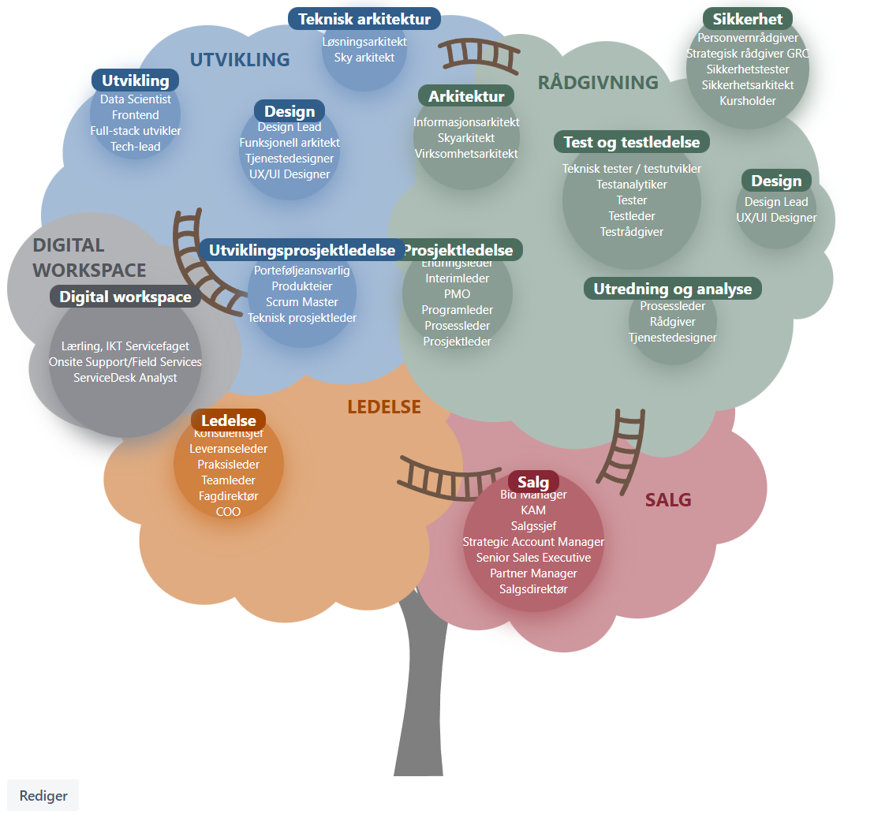
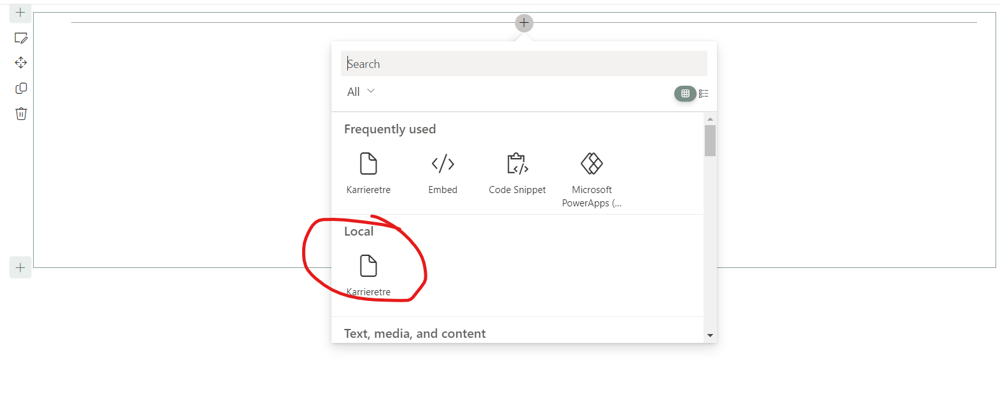

# Karrieretre

## Applies to

- [SharePoint Framework](https://aka.ms/spfx)
- [Microsoft 365 tenant](https://docs.microsoft.com/en-us/sharepoint/dev/spfx/set-up-your-developer-tenant)

> Get your own free development tenant by subscribing to [Microsoft 365 developer program](http://aka.ms/o365devprogram)

## Local development
Install nodejs 16

- Clone this repository
- Ensure that you are at the solution folder
- in the command-line run:
  - ``npm install``
  - ``npm run trust`` (First time only)
  - ``npm run start-dev``
  - Go to https://manpowergroupapps.sharepoint.com/sites/NO-xeek/_layouts/15/workbench.aspx

You must refresh on every change.

## Deploy New version to Sharepoint Xeek

### Build new solution
1. Iterate version in config/package-solution.json
2. Run ``npm run deploy-prod``
3. The packaged solution should be stored in ``sharepoint/solution/karriertre.sppkg``

### Deploy new solution
1. Go to https://manpowergroupapps.sharepoint.com/sites/NO-xeek/_layouts/15/viewlsts.aspx
2. Go to "Apps for Sharepoint"
3. Upload solution file: ``sharepoint/solution/karriertre.sppkg`` and deploy

## References

- [Getting started with SharePoint Framework](https://docs.microsoft.com/en-us/sharepoint/dev/spfx/set-up-your-developer-tenant)
- [Building for Microsoft teams](https://docs.microsoft.com/en-us/sharepoint/dev/spfx/build-for-teams-overview)
- [Use Microsoft Graph in your solution](https://docs.microsoft.com/en-us/sharepoint/dev/spfx/web-parts/get-started/using-microsoft-graph-apis)
- [Publish SharePoint Framework applications to the Marketplace](https://docs.microsoft.com/en-us/sharepoint/dev/spfx/publish-to-marketplace-overview)
- [Microsoft 365 Patterns and Practices](https://aka.ms/m365pnp) - Guidance, tooling, samples and open-source controls for your Microsoft 365 development
